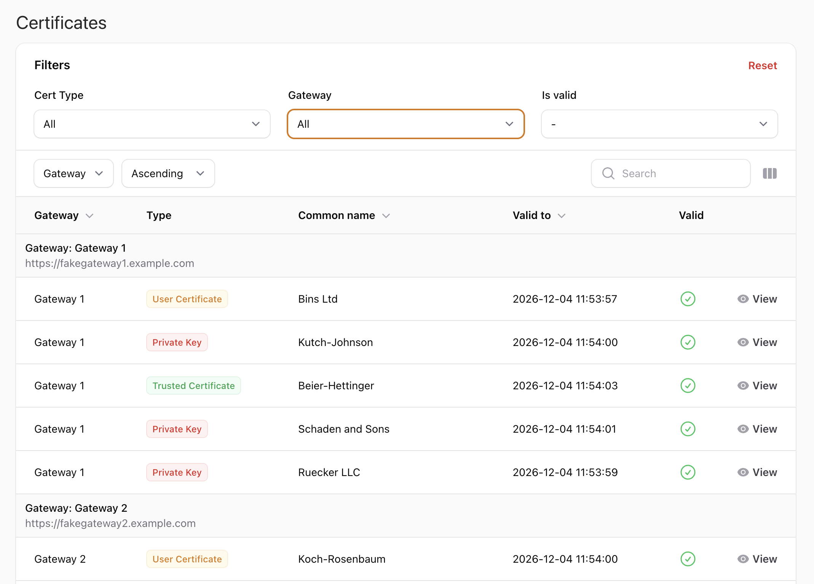
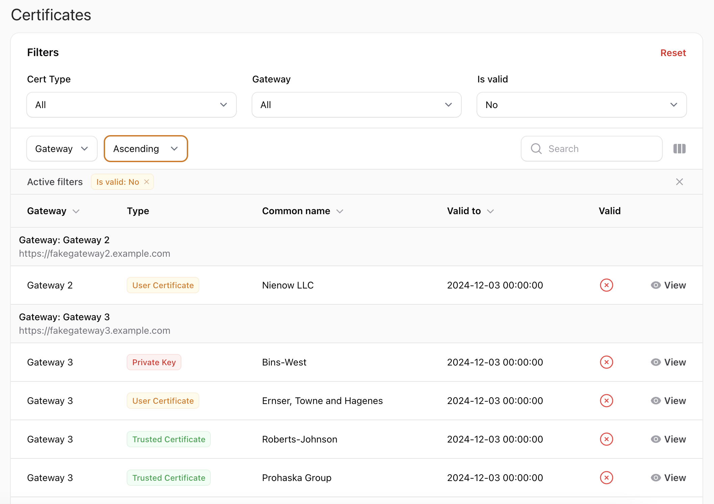

# Layer7 API Gateway Certificate Manager

This Laravel 11 project is designed to manage certificates from multiple Layer7 API Gateways. It fetches private keys, trusted certificates, and user certificates, stores them in a database, and provides a clean and user-friendly interface for viewing and managing them.

---

## Features

- Fetch certificates from various Layer7 API Gateways.
- Store private keys, trusted certificates, and user certificates in a database.
- Display certificates in a clean and user-friendly interface.
- Console commands for importing data.
- Flexible and extensible architecture.

The main page is basically a Filament Table with all the information of certificates imported



You can filter for Certificare Type (User, Trusted, or Private Key), by Gateway or with free text search.

>Note that only the public part of your private keys are imported!

You can also show only valid (i.e., unexpired) certificates or only expired ones



### Certificate Details

For every certificate you can see the details


and even see the complete PEM file if needed


---

## Prerequisites

- PHP 8.2 or higher
- Laravel 11
- Composer
- A database (MySQL, PostgreSQL, SQLite, or similar)
- Layer7 API Gateway credentials and endpoints

---

## Installation

1. **Clone the repository**

   ```bash
   git clone https://github.com/marco-introini/layer7-certconsole.git
   cd layer7-certconsole
   ```

2. **Install dependencies**

   ```bash
   composer install
   ```

3. **Set up environment**

    - Duplicate `.env.example` as `.env` and configure your database and API settings.

4. **Generate application key**

   ```bash
   php artisan key:generate
   ```

5. **Run migrations**

   ```bash
   php artisan migrate
   ```

6. **Insert Layer7 gateway credentials**

Insert the correct data inside the `gateways` table

## Dummy Data

It's possible to seed fake data for testing this project

```bash
php artisan db:seed --class FakeDataSeeder
```

---

## Usage

### Importing Certificates

Run the following Artisan commands to fetch and store certificates:

1. **Import Private Keys Public Certificates**

   ```bash
   php artisan import:private-keys
   ```

2. **Import Trusted Certificates**

   ```bash
   php artisan import:trusted-certs
   ```

3. **Import User Certificates**

   ```bash
   php artisan import:user-certificates
   ```

### Accessing the Interface

Once the setup is complete, start the development server:

```bash
php artisan serve
```

Navigate to `http://localhost:8000` to access the certificate management interface.

---


## Project Structure

- **Console Commands**: Located in the `app/Console/Commands` directory.
- **Certificate Models**: Represented in `app/Models`.
- **Database Migrations**: Found in `database/migrations`.
- **Web Interface**: Views are in `resources/views`.

---

## Contributing

Contributions are welcome! Please follow these steps:

1. Fork the repository.
2. Create a new feature branch.
3. Commit your changes and push them to your fork.
4. Open a pull request.

---

## License

This project is licensed under the [MIT License](LICENSE).

---

## Support

If you encounter issues or have questions, feel free to open an issue or contact the maintainer.

---

### Notes

- Ensure Layer7 API Gateway credentials are stored correctly inside the `gateways` db table.

---

**Happy Coding!** 🚀
